<h1>Come To Cork</h1>

I had the challenge of developing a dynamic front end project, with custom written Javascript, HTML and CSS code and cosisting of one or more HTML pages.
I have created a made up tourism site for domestic and international tourists planning a trip to Cork, Ireland. This website will use the Google maps API, so users can interact with the site and have a better understanding of where things are located.
I also implemented a corona virus API, which allows potential visitors to get a live update on the number of cases and deaths in Ireland due to covid-19. This will allow users to make an informed decision on whether it is safe to visit Ireland or not. 
They will also be guided on the Government restrictions in place as every country differs In terms of the laws and regulations. 

<h2 align="center">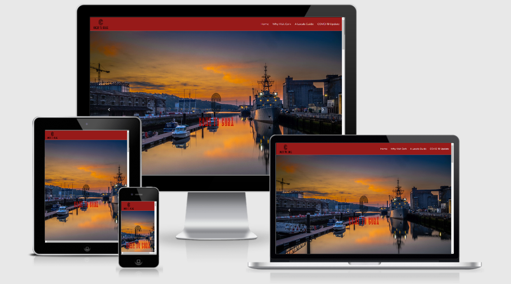</h2>

## USER EXPERIENCE (UX)

Consumers who are contemplating a potential trip away invest time in researching potential destinations through reviews, experiences content blogs and search engines. A holiday is experiential rather than materialistic so it's not an impulse decision in most cases. People want to know they are going to get a unique new experience on their next holiday. There is also a trend in tourism that visitors have a cultural appreication for hidden gems and living like a local. 
I considered all of these factors and trends when designing my website. 

The key goals for Come to Cork are:
 
1. Promote Cork City as a tourist destination.

2. Allow users/potential city break tourists to make an informed decision and include cork as part of their conderation set when thinking of a city break away. 

    ### User Stories

*   As a user I want to see some images of the scenic locations I may visit when arriving in Cork. 
    * This is the reason for the eye catching Hero image with the image slider. This will showcase some high quality photos of cork which will slide every 5 seconds. 

*   As a user I want to skip ahead of the 3second slide timer as I have seen enough of this image.
    * The reason for inserting a button the left and right of the hero image, so the user can interact with the page. 

*   As a user I want to see the main attractions of Cork and what makes it different from the other cities in Ireland. 
    * 	The reason for the “why visit Cork” section which will give a brief description of its history, food culture, famous locations and social life. 

*   As a user I want to see some recommended places to visit as a I don’t know Cork very well, and I want to know some of the locations a local person would go to.
    *   Reason for the tab panel beside the map which gives bar, hotel, restaurant and other tourist recommendations.
    
*   As a user I want be able to plan my trip using a map so I have an idea of where everything Is and I can make itinerary. 
    * Reason for the google map. 

*   As a user I want to know how many cases of Corona Virus there is in Ireland so I know whether it is safe to visit Cork or not.
    * Reason for the Corona Virus Api. 

    ### Wireframes 
I used [Balsamic](https://balsamiq.com/) to build the wireframes. I created mockups for desktop, tablet and mobile viewports so i could have an idea of what my website would look like and a plan i could follow to avoid scope creep.

Desktop Wireframes

  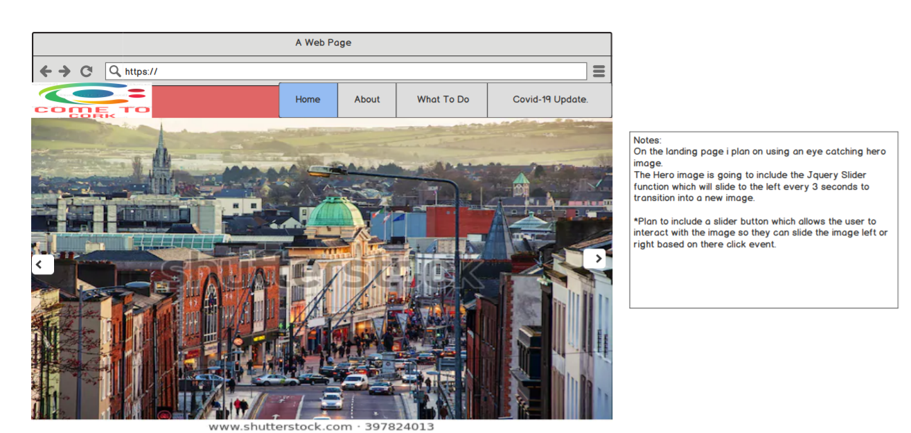</a>

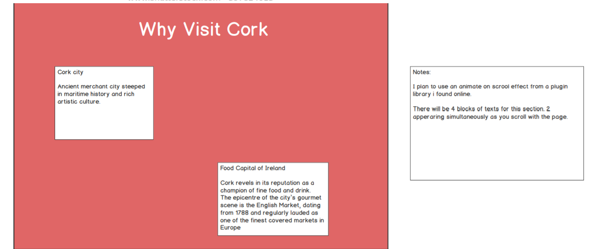</a>

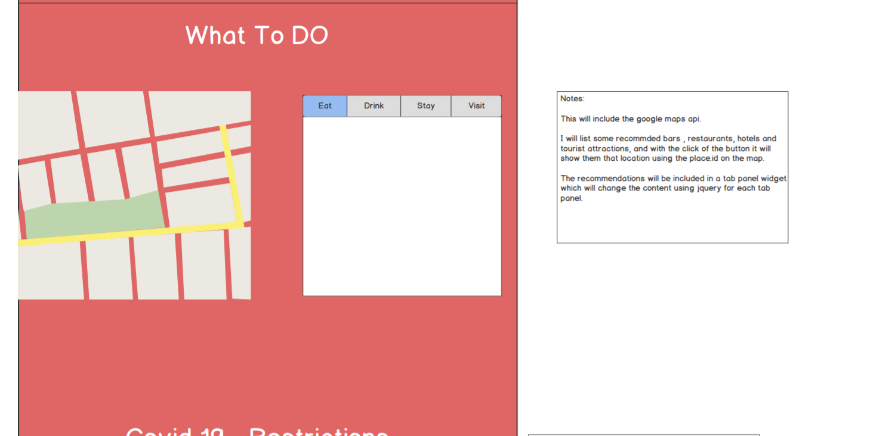</a>

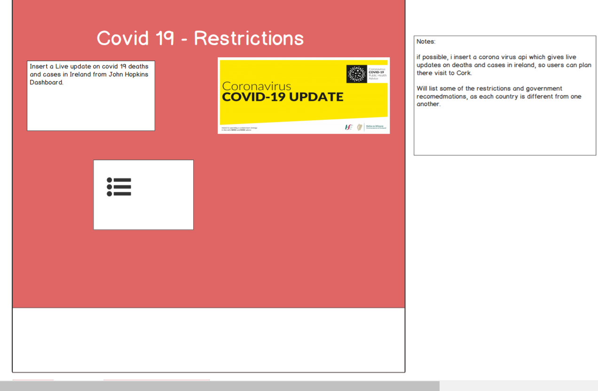</a>

Tablet Wireframes

  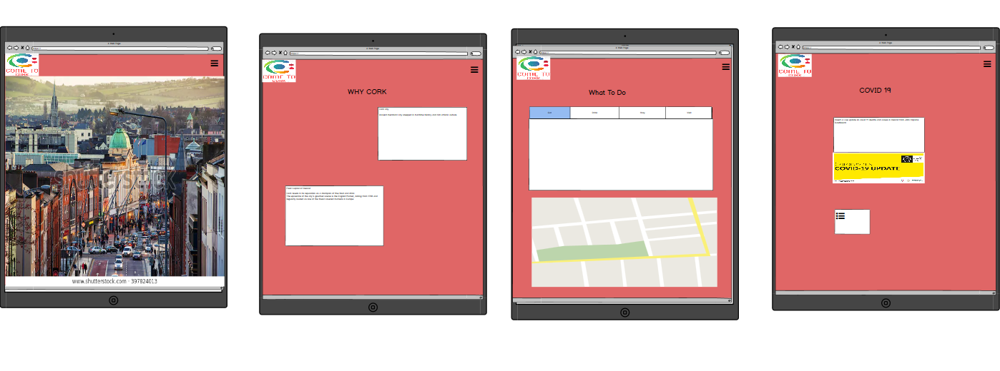</a>

Mobile Wireframes

  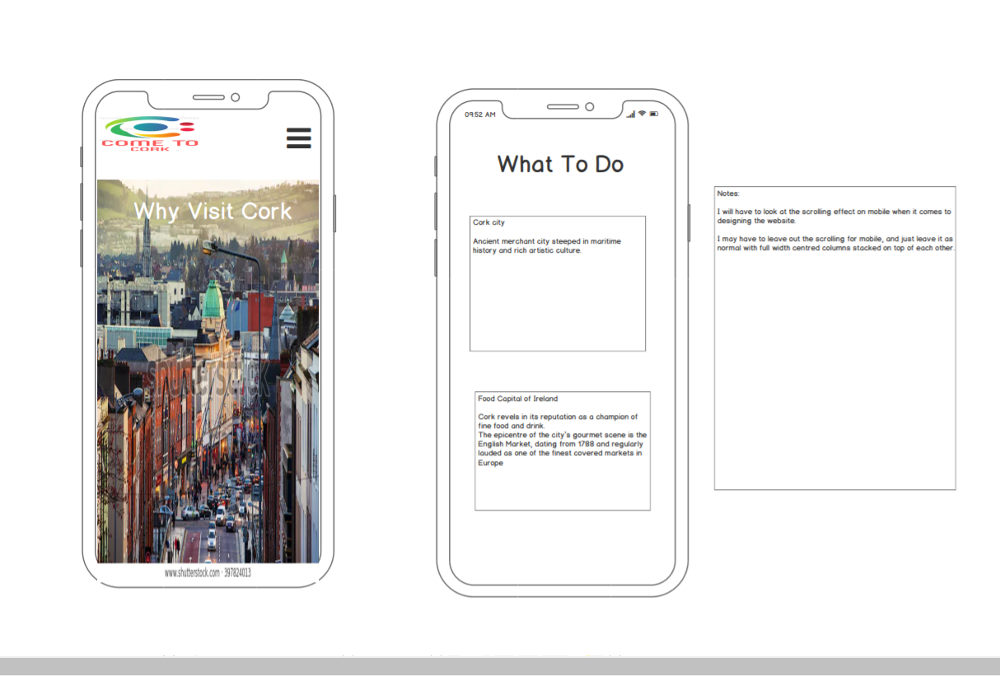</a>

  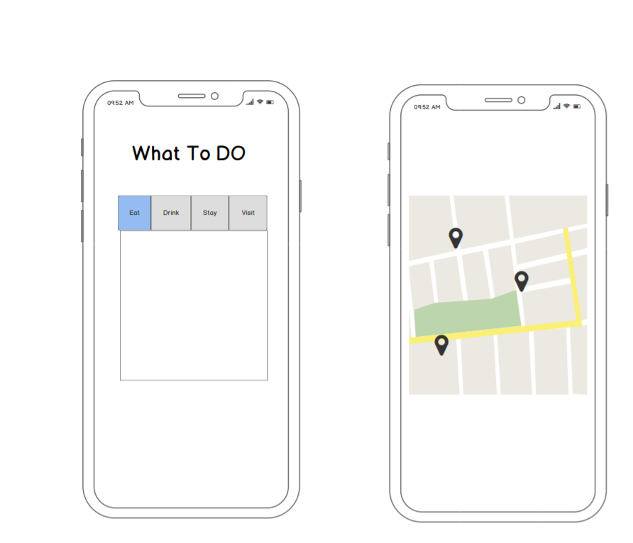</a>

## DESIGN

### Framework
I used <a href="https://getbootstrap.com/" target="_blank">Bootstrap</a> to build the framework of the website. Bootstrap was  the main tool frame responsible for making the Come to Cork website responsive. This means the website automatically resizes itself to look good on all devices, be it mobile, tablet, laptop or desktop. 

### Colour Scheme

<b>Red</b> Red is the most imposing and dominate colour on the Come To Cork website. As you can see from my wireframes, i initially planned on using red even more as the main background colour, however i later felt red is a very powerful and imposing colour and too much of it could distract the reader and make it unreadable. Red is the colour associated with county cork so it had to be the main colour of the website. I used a dark red as i felt brighter colours cheapened the brand and website. I feel i got the right combination of attention getting and exciting red paired with a white background and font. 

<b>White</b> As mentioned above, the white was used to give the red a softer feel in places. I wanted to go for a clean look and I also feel it fits well, too much colors could be overpowering and distract the user from the key information 

<b>Charcoal</b> – I used a charcoal background in the ‘Covid 19 Update’ section. The Charcoal section adds a sense of change to the page and also gives a modern feel when paired with the burlywood and softer red coloured font. 

#### List of all the colours used throughout the website: 
* #9D1821 Main dark red used.
* #ff515d85 Lighter slight pink red.
* #030303d6 Dark charcoal.
* #555555 Lighter charcoal. 
* #d5d0d0 Silver.
* #a1720bbb Gold.
* Burlywood.
* Black.
* White.

### Typography 
The “Montserrat” font is the font used for all the headings and the “Lora” font is the font used for the body of the website. Sans serif and serif are set as the fallback font in case for any reason the font isn't being imported into the site correctly.

### Imagery 
Imagery is a reoccurring theme throughout the website. I felt images played a vital role in influencing a users desicion in choosing a holiday destination, and it allows people place themselves in a patricular place without being there. 
The Hero image especially works well in drawing the user in and given the website a very modern feel.

## FEATURES

### Hero Image
* The Landing page sets the theme for the layout of the entire website. There is an eye catching hero image, which is clean looking. The hero image uses a <a href="https://getbootstrap.com/docs/4.5/components/carousel/" target="_blank">bootstrap carousel</a> to slide every 5 seconds. The user also has the option to skip ahead with a 'next' and 'previous' button.
The hero images include some iconic locations in Cork, like st.Fin Barre's Cathedral, the port of Cork and the Blarney Castle. I created a logo for the brand using <a href="https://www.tailorbrands.com/" target="_blank">Tailor Brands</a>. In my opinion, its clean looking, eye catching and fits well with the theme of the website and the tourism industry.

    

    
Hero Image

    

    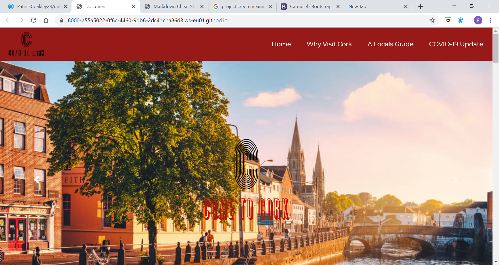</a>
    

    

### Why Visit Cork
*   I considered visual hierarchy and I felt this section was best placed as the most immediate section after the hero image, as it allows to get a feel for Cork and become more aware of the unique selling points of Cork City. I supported each column of information with a related image which gives each subsection more importance and more of a 'wow' factor. 
* Included in this section is a sliding effect plugin from <a href="https://michalsnik.github.io/aos/" target="_blank">AOS</a>, as it gives a sense of change and anniamtion to the section.

   

    
Why Visit Cork Section

    

    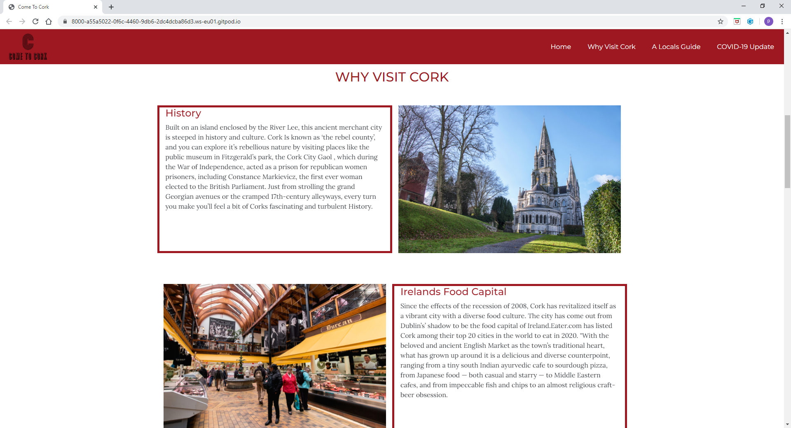</a>
    

    

* **Responsive alterations** - For displays smaller than 768px width the sections are stacked on top of each other and the images are no longer displayed.Two of the images(GAA and the Stacked image) are hidden from mobile view. In the absence of the images, Icons from font awesome are introduced to add a sense of fun to the page.
    

    
Responsive Changes

    

    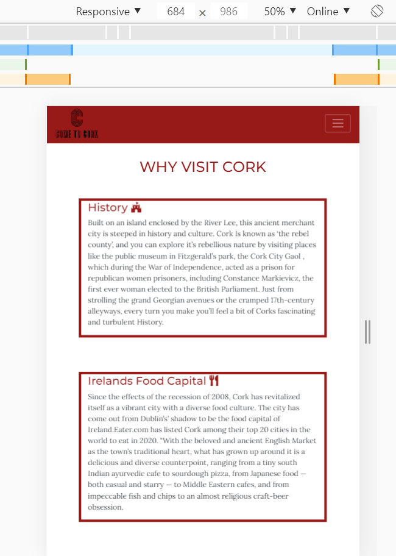</a>
    

    
 

### A Locals Guide 
*   This section is the main interactive section for the user. The Google Map api is included in this section and allows users to scroll through different places in Cork and when they click the location markers information pertaining to that location appears. 
*   Beside the map is the tab panel widget which was built using <a href="https://jquery.com/" target="_blank">JQuery</a>. Whenver the user clicks the sections within the tab panel i.e hotels, bars, restaurant or tourist attractions, locations associated to this business categories appear on the map. I have listed four locations under each section as they are local recommedations and meets the needs of consumers wanting to experience hidden gems and living like the locals.

    

    
A Locals Guide

    

    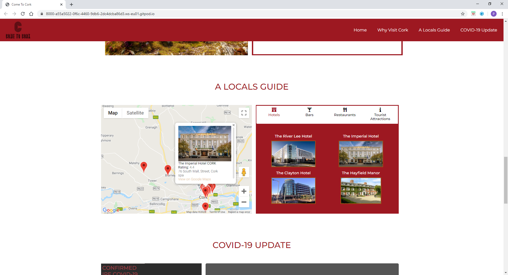</a>
    

    
 

* **Responsive alterations** - The map and the tab panel are stacked on top of each other at screen widths lower than 992px. 
I altered the order in which they are presented for mobile view, as the user gets a sense of the different locations in Cork first before being presented with a map that otherwise may have no meaning to them.

    

    
Responsive Changes

    

    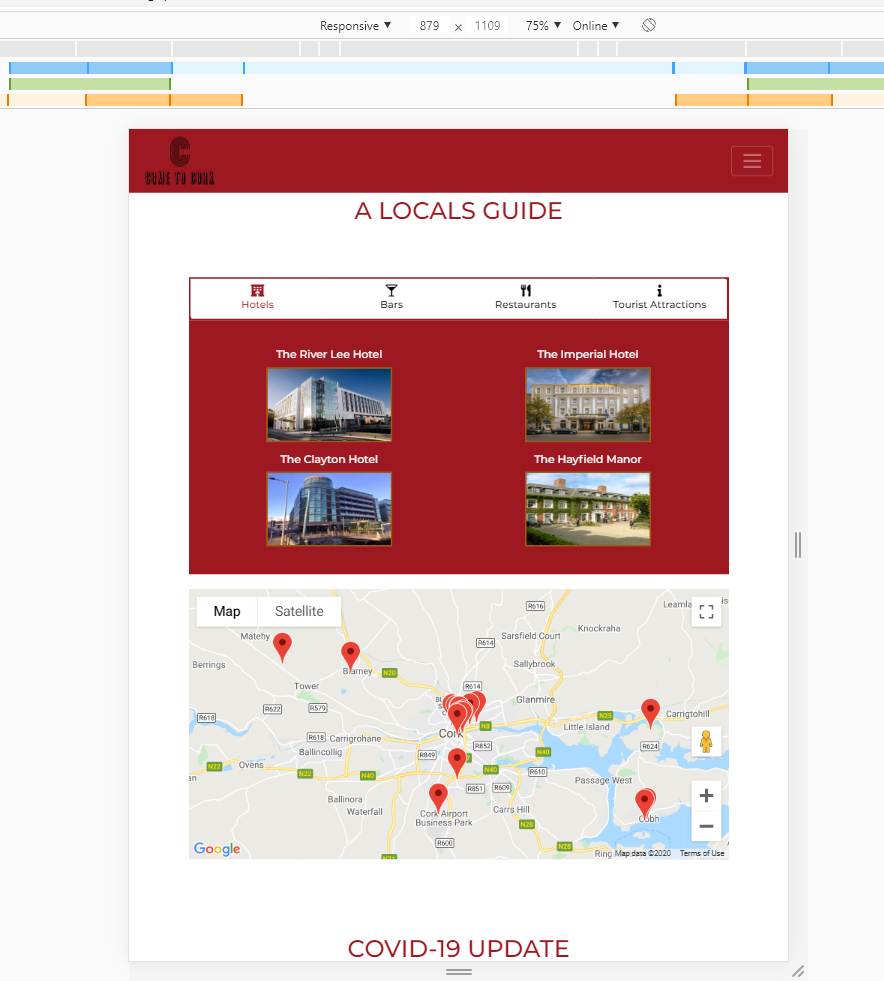</a>
    

    
 

### COVID-19 Update
* During these uncertain times i felt it was necessary to reassure them with any concerns they may have with travelling during Covid-19. Included some government guidelines so users can be better prepared and i also included an api which uses the <a href="https://coronavirus.jhu.edu/map.html" target="_blank">John Hopkins Coronavirus Resouce</a> to include figures of cases specific to Ireland which updates daily. 

    

    
Covid-19 Section

    

    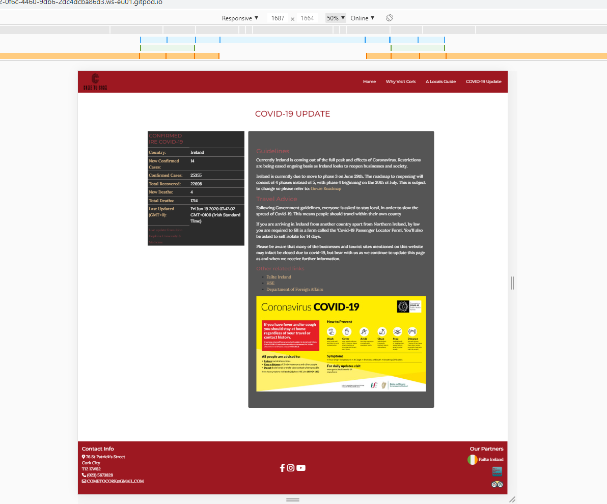</a>
    

    
 

* **Responsive alterations** - The guidelines section and the table are stacked on top of each other at screen widths lower than 768px. The order in which they are presented is also changed as i felt the table would be meaningless for users unless they got a bit of supporting information first.

     

    
Responsive Changes

    

    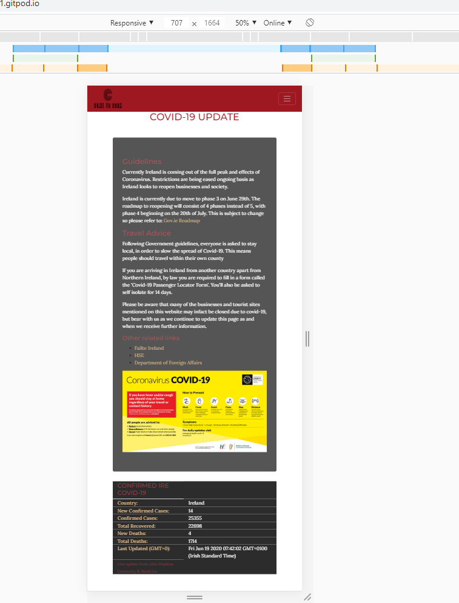</a>
    

    
 

## API Features
API is the acronym for Application Programming Interface, which is a software intermediary that allows two applications to talk to each other. Each time you use an app like Facebook, send an instant message, or check the weather on your phone, you’re using an API.

For this milestone project i was tasked with implimenting at least one API which allows users to interact with the site. 
The API's i implimented on the Come To Cork website are the Google Maps API which allows users to select and search relevant hotels, restaurants, tourist attractions and bars in Cork City. I also included a Corona Virus API which updates daily and gives figues related to Ireland only.

### Google Maps Api
I followed the <a href="https://developers.google.com/maps/documentation/javascript/importing_data" target="_blank"> Google Documentation</a> to render my map on my website. I used <a href="https://en.wikipedia.org/wiki/JavaScript" target="_blank">javascript</a> functions to upload the map centered in Cork City by including the city's latitude and longitude. The markers are applied by incuding the <a href="https://developers.google.com/places/web-service/details" target="_blank">Google Places</a> library and using a javascript event listener to render the specific inforation related to that location when a user clicks on the marker. 
When the page first loads the google maps renders markers for hotels in Cork City. I added a <a href="https://jquery.com/" target="_blank">JQuery</a> click event which loads markers specific to each category(bars/restaurents/tourist-attraction/hotels) when the tab panel is clicked. 

I was hoping to make the google maps more dynamic by adding more information about each location. The documentation for Google Maps Places,(as shown in the first image below) states there is plenty of details you can upload from the API, but Unfortunately a number of key details i would have liked to include like: 'Url', 'website', 'formatted phone number', 'price level' and 'review' were missing in the JSON file when i pulled up the API (as seen in the second image below).

Place Details Documentation

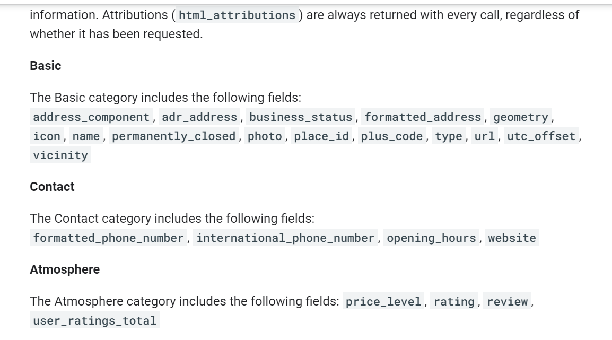</a>

 

Missing Details (Blarney Castle Hotel example)

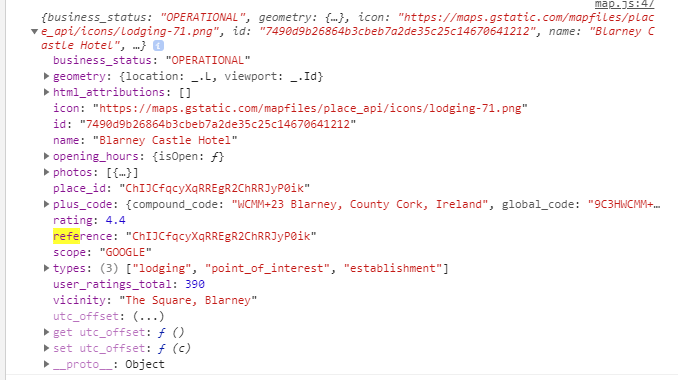</a>

 

### Covid 19 Api
I used Jquery AJAX to pull data from the <a href="https://documenter.getpostman.com/view/10808728/SzS8rjbc?version=latest#7934d316-f751-4914-9909-39f1901caeb8" target="_none">Covid 19 API</a> which is in JSON format in the first image below, and i then used the Jquery prepend function and CSS styling to present data in a HTML table and is rendered on the website for the user.

Covid 19 data in JSON

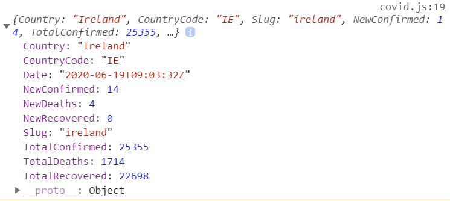</a>

 

How it is presented on the website

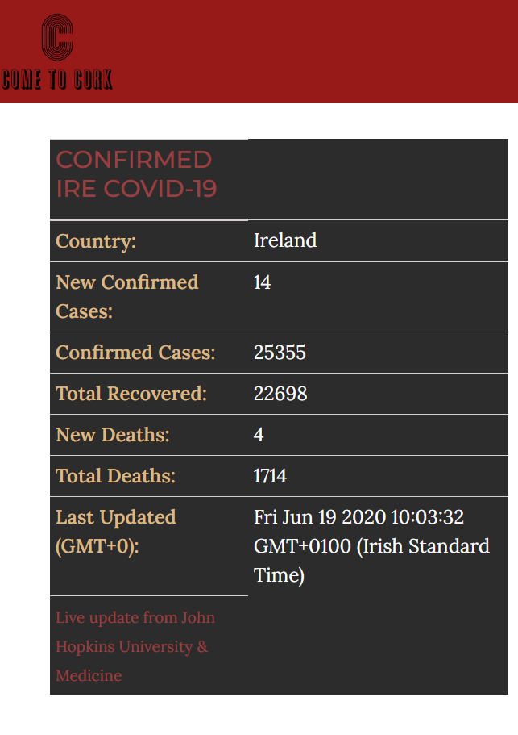</a>

 

### Future Implementation 
1. **Events** - If i had more time i would include a section with upcoming events, from summer festivals, concerts to the world famous Guiness jass festival. It would be great if their was an api that updated this, if not i would updated it manually maybe once a fortnight. This would give users more of a reason to visit Cork and would allow them to plan on the best time to visit.
2. **Booking Hotels** - Unfortunately the <a href="https://www.booking.com/index.en-gb.html?label=gen173nr-1BCAEoggI46AdIM1gEaGmIAQGYAQm4ARfIAQzYAQHoAQGIAgGoAgO4AuTasfcFwAIB0gIkMGI0NDRiZmUtZWY5ZS00OWMzLThlNzgtNTQzY2VhZjgwNzEw2AIF4AIB;sid=4a060d129a8dad61eaedc85866f5450e;keep_landing=1&sb_price_type=total&" target="_blank">Booking.com</a> API is restricted but if i got access to it, it would be improve the website as users wouldn't have to leave the website to make a booking. 
3. **Contact Page** - In the future I plan to implement a contact form which allows users the medium to contact me so they could offer recommedations on places i should include on the website, or possible partnerships or collaborations with tourist realted businesses. 

## TECHNOLOGIES 

### Langauges Used
*   <a href="https://en.wikipedia.org/wiki/HTML5" target="_blank">**HTLM5**</a> - is the standard markup language for documents designed to be displayed in a web browser.
*   <a href="https://en.wikipedia.org/wiki/Cascading_Style_Sheets" target="_blank">**CSS3**</a> -  Cascading Style Sheets is a style sheet language used for describing the presentation of a document written in a markup language like HTML.
*   <a href="https://en.wikipedia.org/wiki/JavaScript" target="_blank">**JavaScript**</a> - JavaScript is among the most powerful and flexible programming languages of the web. It powers the dynamic behavior on most websites.

### Frameworks, Libraries & Programs Used

  1. <a href="https://getbootstrap.com/docs/4.4/getting-started/introduction/" target="_blank">Bootstrap 4.4.1:</a>
        - Bootstrap was used to assist with the responsiveness and styling of the website.</li>
  
2.   <a href="https://fonts.google.com/" target="_blank">Google Fonts:</a>
        - Google fonts were used to import the 'Oswald' font and the 'Open Sans' font into the style.css file which is used on all pages throughout the website.

3.   <a href="https://fontawesome.com/" target="_blank">Font Awesome:</a>
        - Font Awesome was used on throughout the website to add icons for aesthetic and UX purposes.

4.   <a href="https://git-scm.com/" target="_blank">Git:</a>
        - Git was used for version control by utilizing the Gitpod terminal to commit to Git and Push to GitHub.

5.   [GitHub:](https://github.com/)
        - GitHub is used to store the projects code after being pushed from Git.

6.   <a href="https://balsamiq.com/" target="_blank">Balsamiq:</a>
        - Balsamiq was used to create the [wireframes](https://github.com/) during the design process.

7.  <a href="https://jquery.com/" target="_blank">JQuery</a>
    -  jQuery is a JavaScript library designed to simplify HTML DOM tree traversal and manipulation, as well as event handling, CSS animation, and Ajax.
        
## TESTING
We were thought how to the automatic testing framework <a href="https://jasmine.github.io/" target="_blank"> Jasmine</a> as part of Interactive Front End module, but we were told we didn't have to impliment it in our projects as there is limitations with its testing and they're in the process of switching testing frameworks. I therefore carried out manuel testing and document any errors/random side-effects captured in the DevTools.
I loaded the website several times, and forced browser refresh to try and catch any errors but thankfuly there was none. 

    
Dev Tool Testing

    

    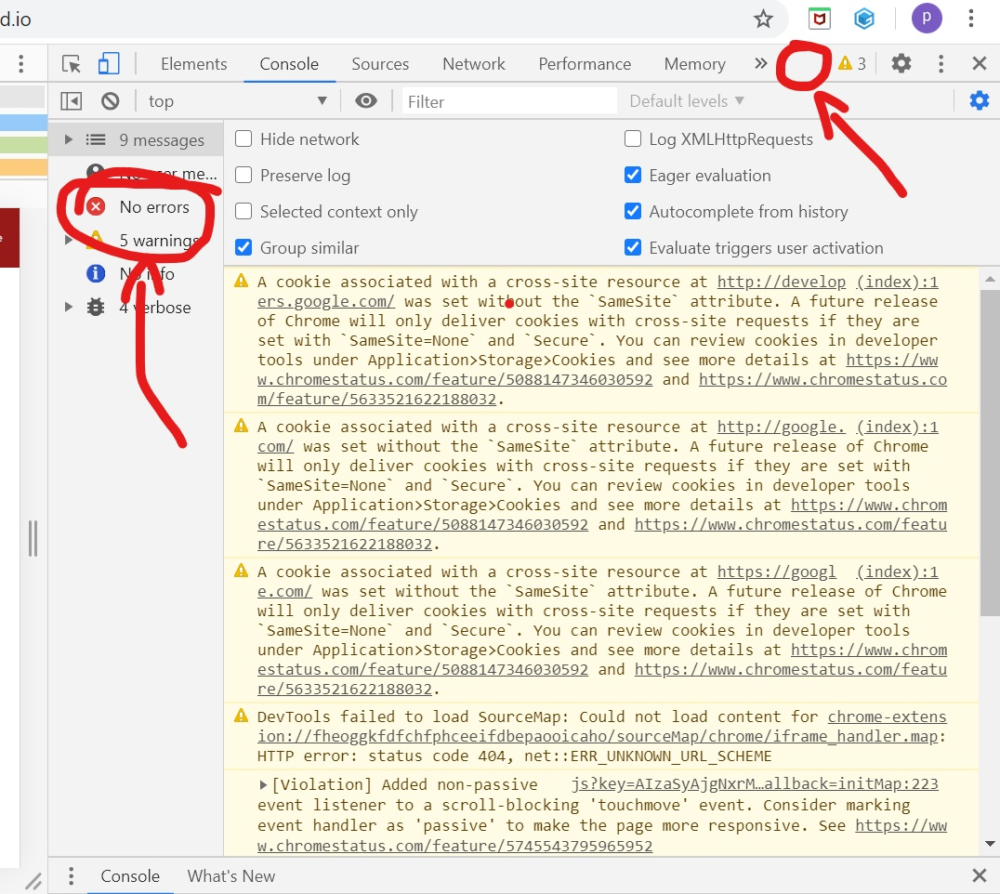</a>
    

    
 

I used <a href="JavaScript source code complies with coding rules." target="_blank">JSHint</a> to check if my javascript source code complied with coding rules. Thank god there were major warnings just warnings about ES6 template literals becuase they are a modern standard and i also have warnings abour '$' being undefined but this is can also be ignored as it's the standard for selecting elements in JQuery.

Three JSHint Validating Test Results

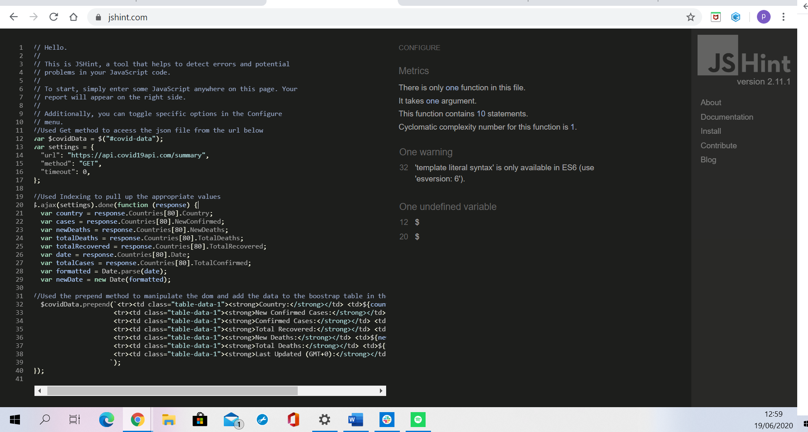</a>

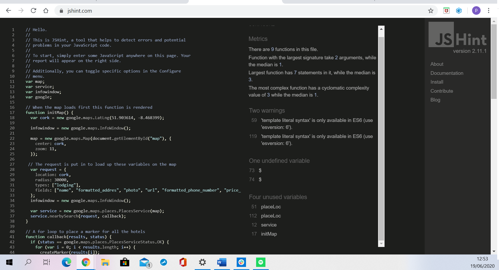</a>

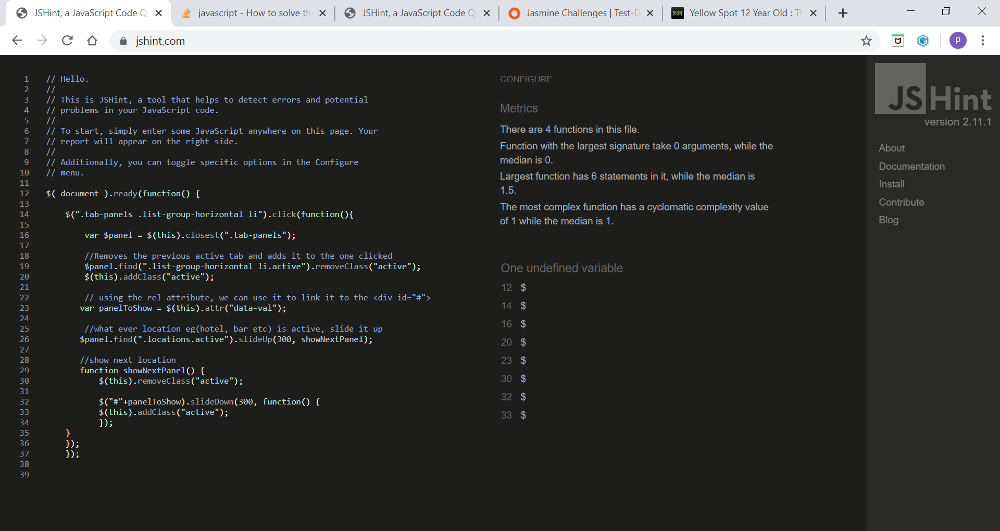</a>

 

I checked my website with the HTML <a href="https://validator.w3.org/" target="_blank">W3C Markup Validator</a> and it resulted in no errors. 

HTML Validator Test Results

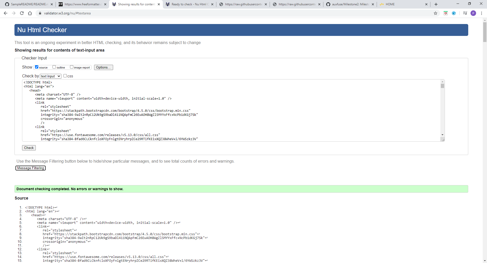</a>

 

I uploaded my css to the <a href="https://jigsaw.w3.org/css-validator/" target="_blank">CSS Validator </a> and again i had no errors.

HTML Validator Test Results

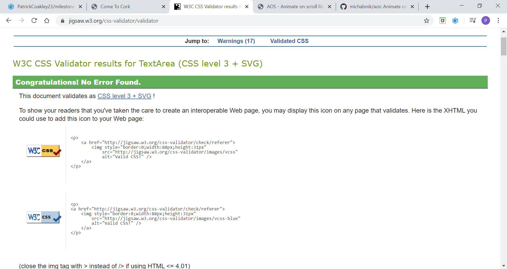</a>

 

I carried out extensive testing of the responsiveness of my mobile by checking how the website rendered on different devices and and lower screen widths.

Come to Cork - Ipad View

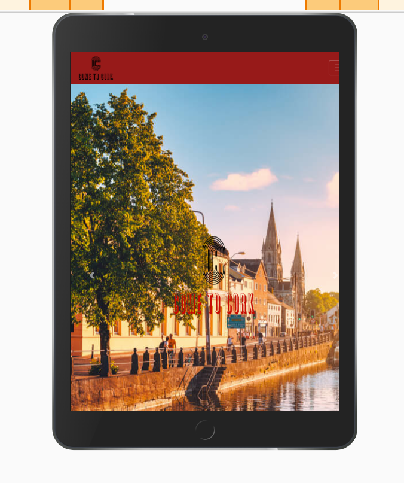</a>

</a>

</a>

</a>

 

Come to Cork - Iphone 6/7/8 view

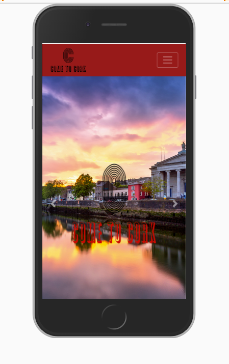</a>

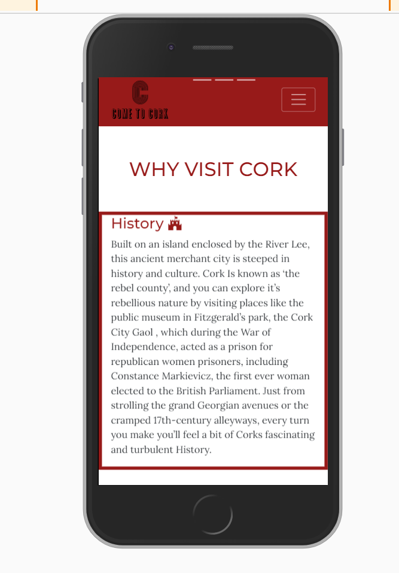</a>

</a>

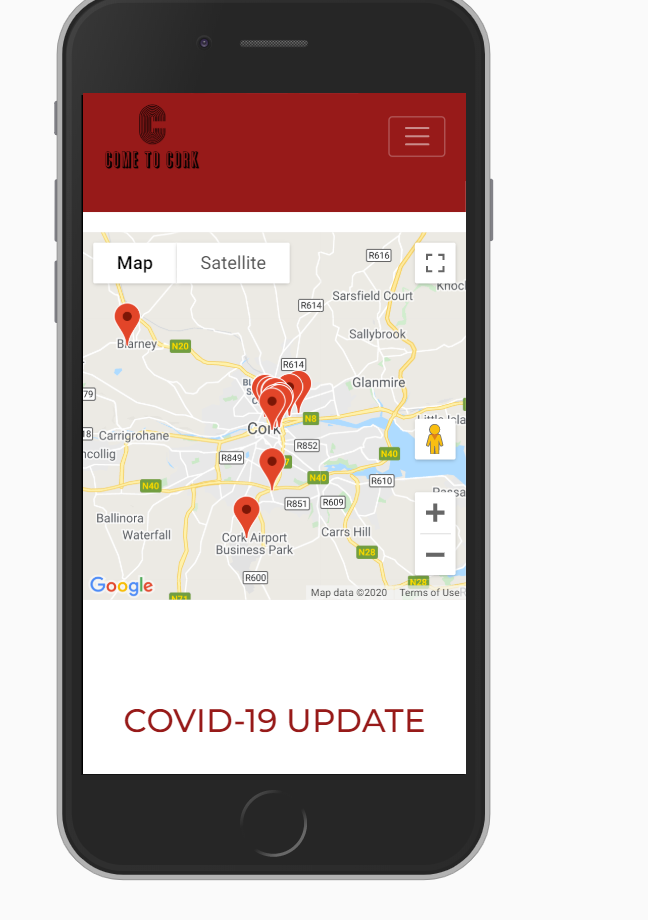</a>

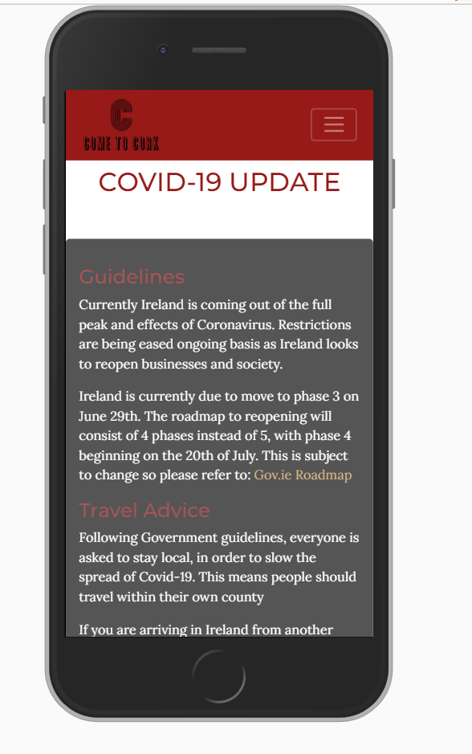</a>

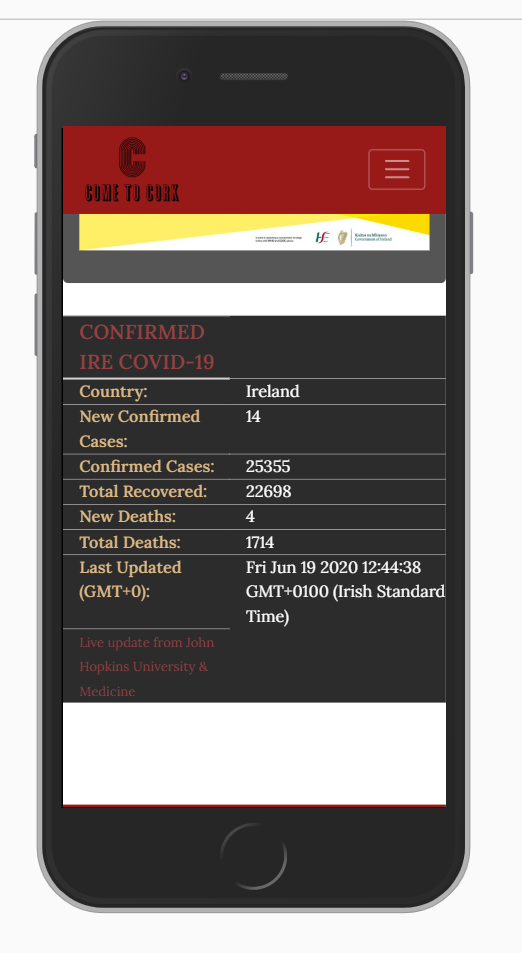</a>

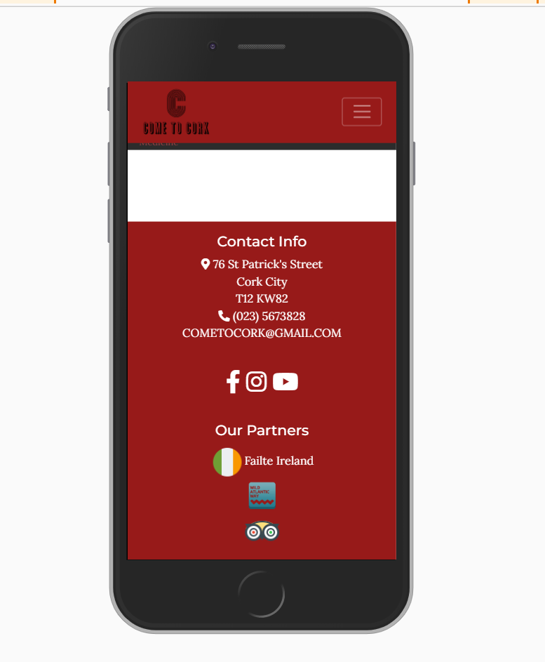</a>

 

I carried out further testing on different devices and different browsers. I created a testing matrix in excel which outlines the various tests i made to ensure the Come to Cork website performed well across various devices and browsers. 

Testing Matrix

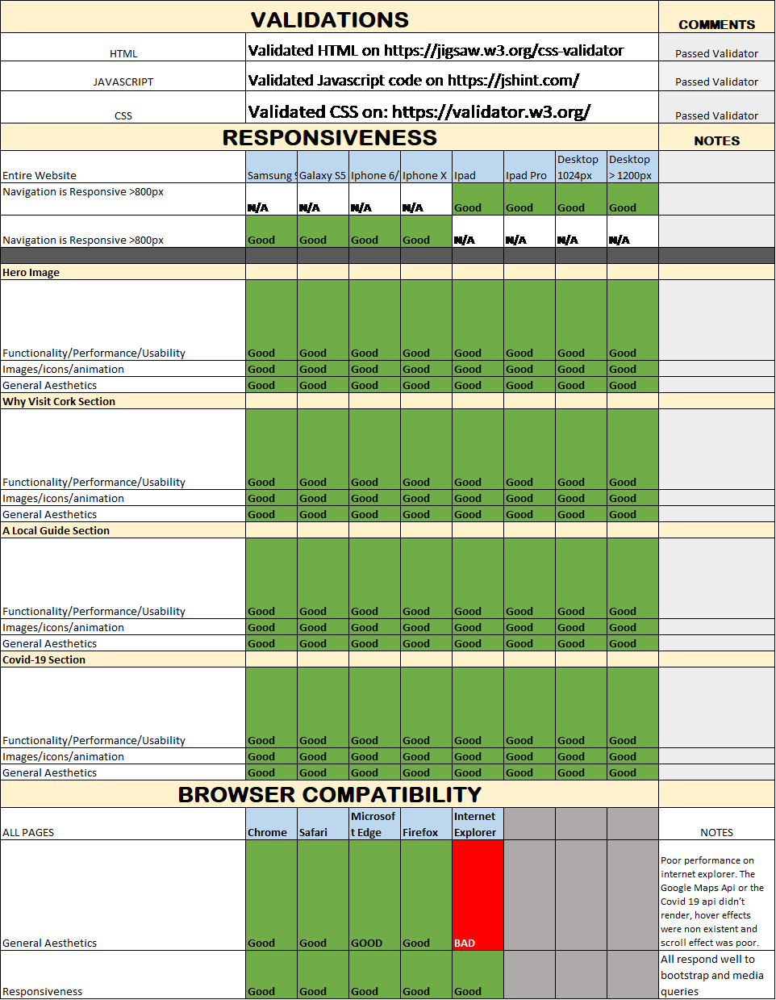</a>

 

* **the main points from this type of testing**
    
  - The Website was tested on Google Chrome,Internet Explorer, Microsoft Edge, Mozilla Firefox and Safari browsers.

  - The website was viewed on a variety of devices such as Desktop, Large Monitor, Laptop, iPhone7, iPhone 8 & iPhoneX.

  - A large amount of testing was done to ensure that all pages were linking correctly e.g making sure all anchor tags had 'taget="_blank"' so they opened up a new browser tab.

  - Friends and family members were asked to review the site and documentation to point out any bugs and/or user experience issues.

    ### Known Bugs
    - On Internet Explorer the two API's don't render on the map, there is no hover effects and the scrolling performace is poor. 

    ## Testing of User Stories
    
1. As a user I want to see some images of the scenic locations I may visit when arriving in Cork.
    * Upon arriving on the website the user is greeted with a clean eye catching hero image which slides every 5 seconds and showcases 4 iconic locations of Cork City
    * There is more iconic images in the "Why Visit Cork" section, especially the cathedral photo and the Baltimore Beacon photos, these images allow the users to visualise what it would be like to visit Cork. 

2. As a user I want to see the main attractions of Cork and what makes it different from the other cities in Ireland.
    * The "Why Visit Cork" section addressed this need as it explains some of the key attractions specific to Cork and what makes this city unique.

3. As a user I want to see some recommended places to visit as a I don’t know Cork very well, and I want to know some of the locations a local person would go to.
    * The "Locals Guide to Cork" addresses this need as it recommends certian locations that general tourist sites woudln't offer. For example, the English Market maybe a famous attraction, but many people outside of Cork wouldn't know of the spectacular 360 degree view from climbing the steps of Shandon Tower. 

4. As a user I want be able to plan my trip using a map so I have an idea of where everything Is and I can make itinerary.
    * The Google map addresses this need as it allows users to scroll around the City of Cork on the Map and bring up some of the hotels, bars, restaurants and tourist attractions placed on the map.

5. As a user I want to know how many cases of Corona Virus there is in Ireland so I know whether it is safe to visit Cork or not
    * The Corona Virus API and the guidelines section are created on this website for this very reason. The guidelines section informs the user of the rules and regualtions specific to Ireland and the table updates daily so users can evaluate the severity of the Virus in Ireland.

6. As a user I want to skip ahead of the 3second slide timer as I have seen enough of this image before and want to see what is next. 
    * We have all been in this situation where we want to skip ahead to another image, this is the reason i have placed the next and previous button on the left and right of the hero image. 

## DEPLOYMENT 
I first set up my repository on Github. Github is a hosting platform which stores and presents my code. After creating a repository on github i click the green 'Gitpod' button which opens my repository in Gitpod. I don't ever create projects directly in Gitpod, i create them in Github, and use the green button to open my project and begin coding.
Gitpod is an IDE (integrated development environment) that allows for software development. It's important when i create a new html file in Gitpod that i name my default file index.html as the server looks for this and loads this page automatically. Once i have inserted some code i can run my page in the browser and within seconds, which allows me to view the web version of my page. Gitpod is where i develop my project, write code and complete debugging issues. An important note, after i have created the repo in Github, we then open the repository each time from Gitpod homepage, which shows us our most recent workspaces. If we were to click the green button in Github every time, this would just create a new version of our repository each time.
In Gitpod, the next step is to commit any significant work and push it to Github. Once in Github, i follow the steps below on how deploy my project. This is where the website goes 'live' and any users who have a link to my project were are to view the site. 

### GitHub Pages
   
The project was deployed to GitHub Pages using the following steps...

1. Log in to GitHub and locate the <a href="https://github.com/PatrickCoakley23/milestone2-project" target="_blank">PatrickCoakley23/milestone-project</a>
2. At the top of the Repository (not top of page), locate the "Settings" Button on the menu.
3. Scroll down the Settings page until you locate the "GitHub Pages" Section.
4. Under "Source", click the dropdown called "None" and select "Master Branch".
5. The page will automatically refresh.
 6. Scroll back down through the page to locate the now published site link in the "GitHub Pages" section.

### Making a Local Clone

1. Log in to GitHub and locate the <a href="https://github.com/PatrickCoakley23/milestone2-project" target="_blank">PatrickCoakley23/milestone-project</a>
2. Under the repository name, click "Clone or download".
3. To clone the repository using HTTPS, under "Clone with HTTPS", copy the link.
4. Open Git Bash
5. Change the current working directory to the location where you want the cloned directory to be made.
6. Type git clone, and then paste the URL you copied in Step 3.
    
            https://github.com/PatrickCoakley23/milestone2-project.git
    
    7. Press Enter. Your local clone will be created.

## CREDITS

### Code

-    Bootsrap 4 - Bootstrap Library used throughout the project mainly to make site responsive using the Bootstrap Grid System.

-   The Scrolling effect in the Why Come to Cork section used a plugin from <a href="https://michalsnik.github.io/aos/" target="_blank">AOS</a>.

-   The tab panel i used was something i learned from following a tutorial from <a href="https://www.youtube.com/watch?v=1nWrIBB_bMA&list=PLoYCgNOIyGACnrXwo5HMCfOH9VT05znGv&index=12" target="_blank">LearnCode.academy</a>

### Media 

- The Come To Cork Logo was created using <a href="https://www.tailorbrands.com/" target="_blank">Tailor Brands</a>. 

- <a href="https://www.shutterstock.com/home" target="_blank">Shutterstock</a> and <a href="https://www.flickr.com/search/?text=mutton%20lane%20cork" target="_blank">Flickr</a> was the source for all the imagery used on the website. 

- <a href="https://fontawesome.com/start" target="_blank">Font Awesome</a> was the source for all the icons bar the Irish flag and Tripadvisor icon in the footer which were sourced from <a href="https://icons8.com/icons" target="_blank">Icons8</a>

### API's 

- <a href="https://documenter.getpostman.com/view/10808728/SzS8rjbc?version=latest#7934d316-f751-4914-9909-39f1901caeb8" target="_blank">Postman</a> for the <a href="https://coronavirus.jhu.edu/map.html" target="_blank">John Hopkins Coronavirus Resouce</a> Covid-19 API.  

- <a href="https://developers.google.com/" target="_blank">Google Developers</a> for the Google Maps API.

### Content 
 - All content of the website was written by the developer. 

- General lines from [Code Institutes Sample README]( https://github.com/Code-Institute-Solutions/SampleREADME) were used in this README file, for example the 'Deployment' section and the 'Making a Clone' section.

## ACKNOWLEDGEMENTS
- My mentor, <a href="https://github.com/precious-ijege" target="_blank"> Precious Ijege</a>was a great help. The three mentor sessions were invaluable. He explained every suggestion in a clear concise manner, and pointed out bugs i would never have seen.

-  My tutor, <a href="https://github.com/armedcor" target="_blank">Cormac Lawlor</a> was very supportive during the project. Being a past student himself, he was aware of certain issues i was facing and was always at hand to offer support. 

- <a href="https://www.linkedin.com/in/brian-o-grady-18a2153/?originalSubdomain=ie" target="_blank">Brian O' Grady</a> and <a href="https://www.linkedin.com/in/mattrudge73/" target="_blank">Matt Rudge's</a> as the course content great was a great aid in developing my website. 

