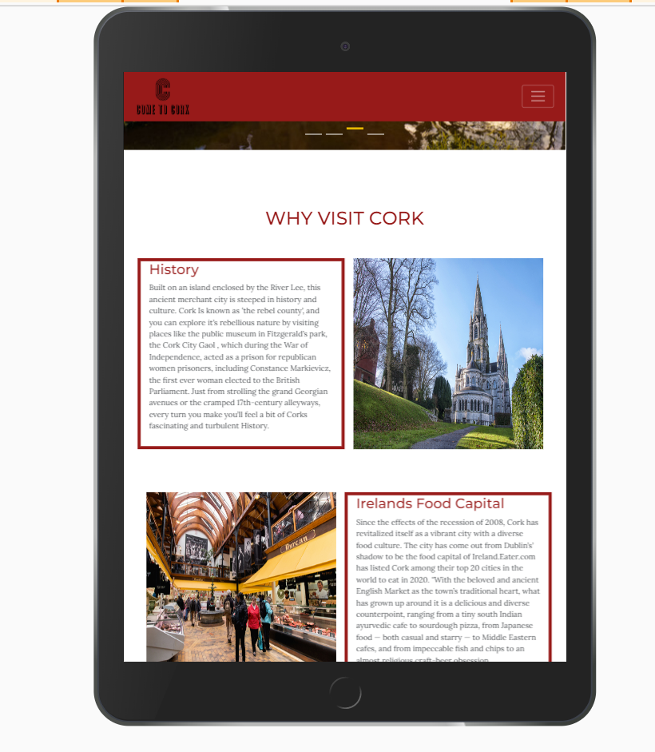
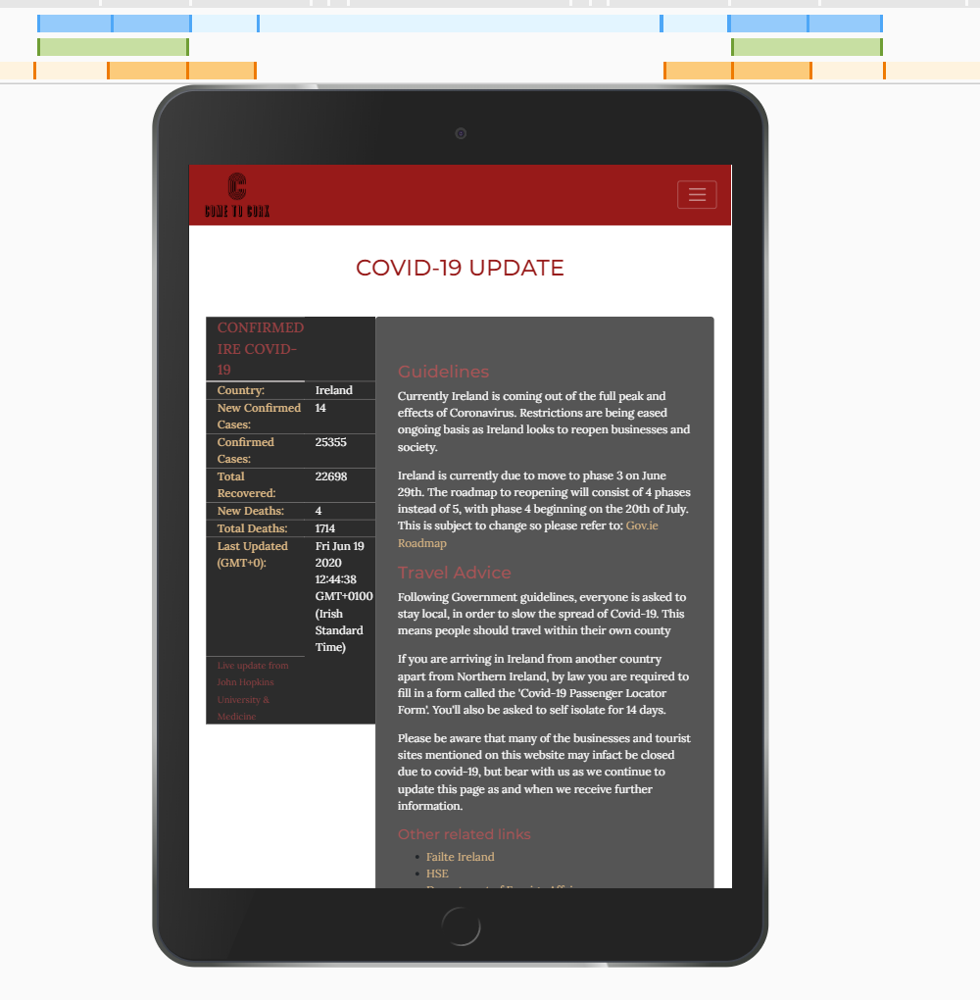
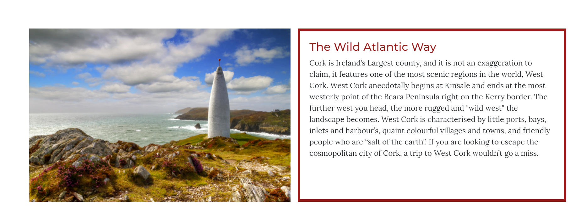
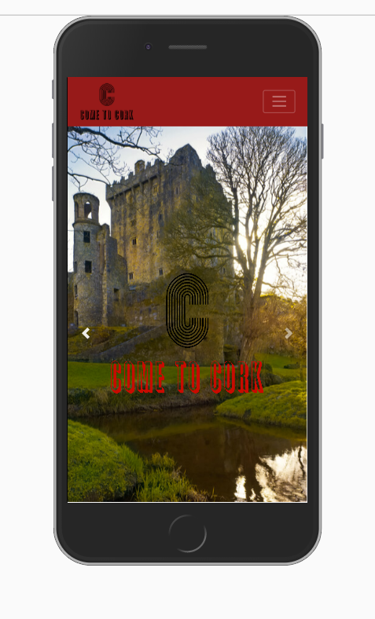
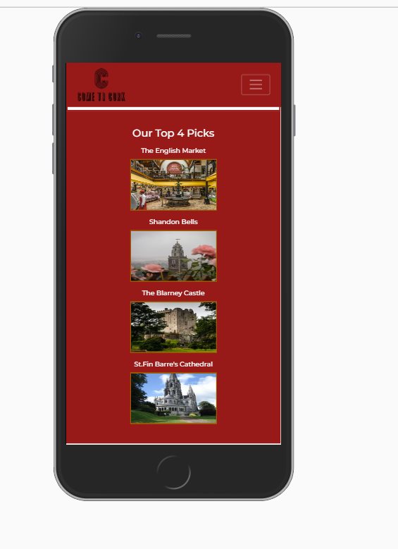
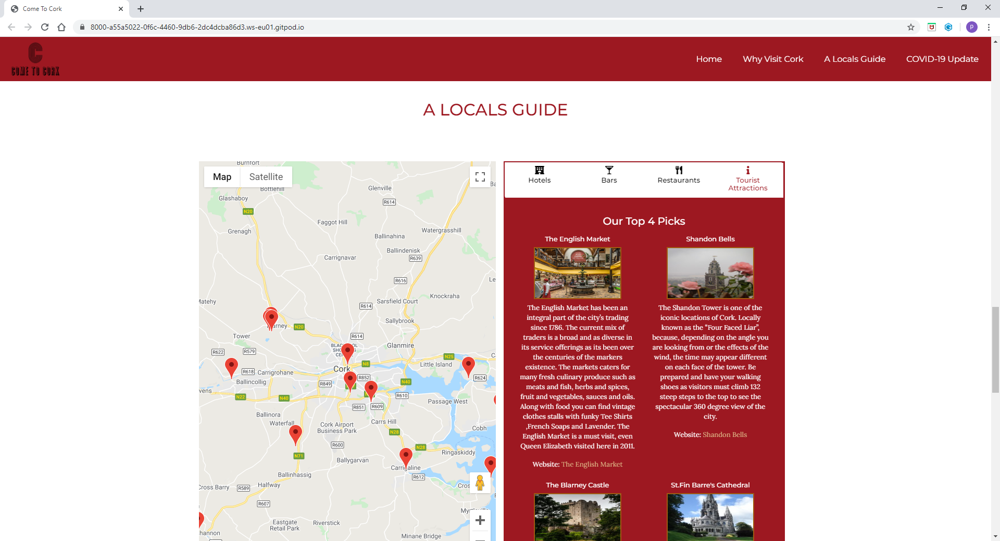
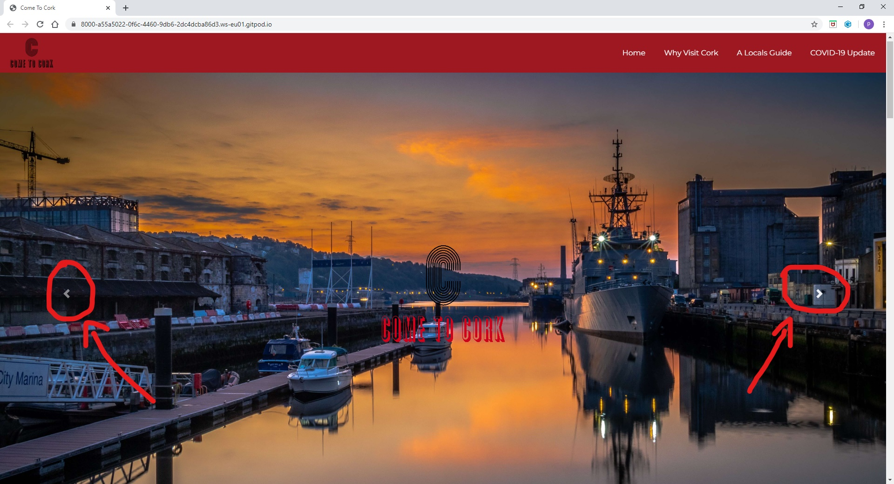
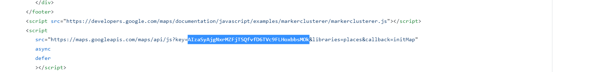

<h1>Come To Cork</h1>

I had the challenge of developing a dynamic front end project with custom written Javascript, HTML and CSS code and consisting of one or more HTML pages.
I have created a made up tourism site for domestic and international tourists planning a trip to Cork, Ireland. This website uses the Google maps API, so users can interact with the site and have a better understanding of where things are located.
I also implemented a Coronavirus API, which allows potential visitors to get a live update on the number of cases and deaths in Ireland due to Covid-19. This allows users to make an informed decision on whether it is safe to visit Ireland or not. 
They will also be guided on the Government restrictions in place as every country differs In terms of the laws and regulations surrounding Covid-19. 

[view the live project here.](https://patrickcoakley23.github.io/milestone2-project/)

<h2 align="center"></h2>

## USER EXPERIENCE (UX)

Consumers who are contemplating a potential trip away, invest time in researching potential destinations, through reviews, experiences, content blogs and search engines. A holiday is experiential rather than materialistic, so in most cases it's not an impulse decision. People need assurances that they are going to get a unique new experience on their next holiday. There is also a trend in tourism, where visitors have a cultural appreciation for hidden gems and living like a local. 
I considered all of these factors and trends when designing my website. 

The key goals for Come to Cork are:
 
1. Promote Cork City as a tourist destination.

2. Allow users/potential city break tourists to make an informed decision and to include cork as part of their consideration set when thinking of a city break away. 

    ### User Stories

*   As a user I want to see some images of the scenic locations I may visit when arriving in Cork. 
    * This is the reason for the eye catching Hero image with the image slider. This will showcase some high quality photos of cork which will slide every 5 seconds. 

*   As a user I want to skip ahead of the 3 second slide timer as I have seen enough of this image.
    * The reason for inserting a button to the left and right of the hero image, so the user can interact with the page. 

*   As a user I want to see the main attractions of Cork and what makes it different from the other cities in Ireland. 
    * 	The reason for the “Why Visit Cork” section which will give a brief description of its history, food culture, famous locations and social life. 

*   As a user I want to see some recommended places to visit as a I don’t know Cork very well, and I want to know some of the locations a local person would go to.
    *   Reason for the tab panel beside the map which gives bar, hotel, restaurant and other tourist recommendations.
    
*   As a user I want be able to plan my trip using a map so I have an idea of where everything Is and I can make itinerary. 
    * Reason for the google map. 

*   As a user I want to know how many cases of Corona Virus there is in Ireland so I know whether it is safe to visit Cork or not.
    * Reason for the Corona Virus Api. 

    ### Wireframes 
After reading the project brief i formulated a idea and jotted down notes and rough sketches on pen and paper. 
These ideas evolved into creating user stories which helped me formulate a plan to draw up some wireframes. 
I used [Balsamiq](https://balsamiq.com/) to build the wireframes. I created mockups for desktop, tablet and mobile viewports, so i could have an idea of what my website would look like, and i could follow a plan to avoid scope creep.
In the next project I plan to make more detailed, creative wireframes which will reduce the design phase as I will have a clear vision of what the finished project should look like.  

Desktop Wireframes <strong>(Click dropdown for images)</strong>

  </a>

</a>

</a>

</a>

Tablet Wireframes <strong>(Click dropdown for images)</strong>

  </a>

Mobile Wireframes <strong>(Click dropdown for images)</strong>

  </a>

  </a>

## DESIGN

### Framework
I used [Bootstrap](https://getbootstrap.com) to build the framework of the website. Bootstrap was  the main tool frame responsible for making the Come to Cork website responsive. This means the website automatically resizes itself to look good on all devices, be it mobile, tablet, laptop or desktop. 

### Colour Scheme

**Red** - is the most imposing and dominant colour on the Come To Cork website. As you can see from my wireframes, i initially planned on using more red than in the finished website. I felt red is a very powerful and imposing colour and too much of it could distract the reader and make it unreadable. 
Red is the colour associated with Cork, and for this reason i felt it had to be the main colour of the website. I used a dark red as i felt a brighter red could cheapen the brand and the website. I feel i got the right combination of attention getting and exciting red paired with a white background and font. 

**White** - As mentioned above, the white was used to give the red a softer feel. I wanted to go for a clean look as too much colors could be overpowering and distract the user from the key information 

**Charcoal** – I used a charcoal background in the ‘Covid 19 Update’ section. The Charcoal section adds a sense of change to the page and also gives a modern feel when paired with the burlywood and softer red coloured font. 

#### List of all the colours used throughout the website: 
* #9D1821 Main dark red used.
* #ff515d85 Lighter slight pink red.
* #030303d6 Dark charcoal.
* #555555 Lighter charcoal. 
* #d5d0d0 Silver.
* #a1720bbb Gold.
* Burlywood.
* Black.
* White.

### Typography 
The “Montserrat” font is the font used for all the headings and the “Lora” font is the font used for the body of the website. Sans serif and serif are set as the fallback font in case for any reason the font isn't being imported into the site correctly.

### Imagery 
Imagery is a reoccurring theme throughout the website. I felt images played a vital role in influencing a users decision in choosing a holiday destination, as it allows people to place themselves in a particular place without being there. 
The Hero image especially works well in drawing the user in and given the website a very modern feel.

## FEATURES

### Hero Image
* The Landing page sets the theme for the layout of the entire website. The hero image uses a [Bootstrap carousel](https://getbootstrap.com/docs/4.5/components/carousel/) to slide every 5 seconds. The user also has the option to skip ahead with a 'next' and 'previous' button.
The hero images include some iconic locations in Cork, like st.Fin Barre's Cathedral, the port of Cork and the Blarney Castle. I created a logo for the brand using [Tailor Brands](https://www.tailorbrands.com/Tailor). In my opinion, it's clean looking, eye catching and fits well with the theme of the website and the tourism industry.

    

    
Hero Image <strong>(Click dropdown for images)</strong>

    

    </a>
    

    

### Why Visit Cork
*   I considered visual hierarchy here and I felt this section was best placed as the most immediate section after the hero image. This section allows the user to get a feel for Cork and become more aware of the unique selling points of Cork City. I supported each column of information with a related image to make it easier to read. 
* Included in this section is a sliding effect plugin from [AOS](https://michalsnik.github.io/aos/), as it gives a sense of change and animation to the section.

   

    
Why Visit Cork Section <strong>(Click dropdown for images)</strong>

    

    </a>
    

    

* **Responsive alterations** - For screen sizes smaller than 768px wide the sections are stacked on top of each other and the images are no longer displayed.Two of the images (GAA and the Stacked image) are hidden from mobile view. In the absence of the images, Icons from font awesome are introduced to add a sense of fun to the page.
    

    
Responsive Changes <strong>(Click dropdown for images)</strong>

    

    </a>
    

    
 

### A Locals Guide 
*   This section is the main interactive section for the user. The Google Map API is included in this section and allows users to scroll through different places in Cork. When the user clicks the location markers on the map, information pertaining to that location appears. 
*   Beside the map is the tab panel widget which was built using [JQuery](ttps://jquery.com/). Whenever the user clicks the sections within the tab panel (i.e hotels, bars, restaurant or tourist attractions) locations associated to these business categories appear on the map. I have listed four locations under each section as they are local recommendations and meet the needs of consumers, wanting to experience hidden gems and living like the locals.

    

    
A Locals Guide <strong>(Click dropdown for images)</strong>

    

    </a>
    

    
 

* **Responsive alterations** - The map and the tab panel are stacked on top of each other at screen widths lower than 992px. 
I altered the order in which they are presented for mobile view, as the user gets a sense of the different locations in Cork first before being presented with a map that otherwise may have no meaning to them.

    

    
Responsive Changes <strong>(Click dropdown for images)</strong>

    

    </a>
    

    
 

### COVID-19 Update
* During these uncertain times, I felt it was necessary to inform tourists about the numbers of Covid-19 in Ireland and the rules and regulations surrounding Covid-19. I Included some government guidelines so users can be better prepared, and there is an api which uses the <a href="https://coronavirus.jhu.edu/map.html" target="_blank">John Hopkins Coronavirus Resource</a> to include figures of cases specific to Ireland which updates daily. 

    

    
Covid-19 Section <strong>(Click dropdown for images)</strong>

    

    </a>
    

    
 

* **Responsive alterations** - The guidelines section and the table are stacked on top of each other at screen widths lower than 768px. The order in which they are presented is also changed as i felt the table would be meaningless for users unless they got a bit of supporting information first.

     

    
Responsive Changes <strong>(Click dropdown for images)</strong>

    

    </a>
    

    
 

### API Features
API is the acronym for Application Programming Interface, which is a software intermediary that allows two applications to talk to each other. Each time you use an app like Facebook, send an instant message, or check the weather on your phone, you’re using an API.

For this milestone project i was tasked with implementing at least one API which allows users to interact with the site. 
The API's i implimented on the Come To Cork website are the Google Maps API which allows users to select and search relevant hotels, restaurants, tourist attractions and bars in Cork City. I also included a Corona Virus API which updates daily and gives figures related to Ireland only.

### Google Maps Api
I followed the [Google Documentation]( https://developers.google.com/maps/documentation/javascript/importing_data) to render my map on my website. I used [javascript](https://en.wikipedia.org/wiki/JavaScript) functions to upload the map centered in Cork City by including the city's latitude and longitude. The markers are applied by including the [Google Places library](https://developers.google.com/places/web-service/details) and using a javascript event listener to render the specific information related to that location. 
When the page first loads the google maps renders markers for hotels in Cork City. I added a [JQuery](https://jquery.com/) click event which loads markers specific to each category(bars/restaurants/tourist-attraction/hotels) when the tab panel is clicked. 

I was hoping to make the google maps more dynamic by adding more information about each location. The documentation for Google Maps Places,(as shown in the first image below) states there is plenty of details you can upload from the API. Unfortunately a number of key details i would have liked to include like: 'Url', 'website', 'formatted phone number', 'price level' and 'review' were missing in the JSON file when i pulled up the API (as seen in the second image below).

Place Details Documentation ) <strong>(Click dropdown for images)</strong>

</a>

 

Missing Details (Blarney Castle Hotel example) <strong>(Click dropdown for images)</strong>

</a>

 

### Covid 19 Api
I used Jquery AJAX to pull data from the [Covid 19 API](https://documenter.getpostman.com/view/10808728/SzS8rjbc?version=latest#7934d316-f751-4914-9909-39f1901caeb8) which is in JSON format in the first image below. I then used the Jquery prepend function and CSS styling to present data in a HTML table and is rendered on the website for the user.

Covid 19 data in JSON <strong>(Click dropdown for images)</strong>

</a>

 

How it is presented on the website <strong>(Click dropdown for images)</strong>

</a>

 

### Future Implementation 
1. **Events** - If i had more time i would include a section with upcoming events, from summer festivals, concerts to the world famous Guinness jazz festival. It would be great if there was an api that updated this, if not i would update it manually maybe once a fortnight. This would give users more of a reason to visit Cork and it would allow them to better plan the time of year they visit.
2. **Booking Hotels** - Unfortunately the [Booking.com]( https://www.booking.com/index.en-gb.html?label=gen173nr-1BCAEoggI46AdIM1gEaGmIAQGYAQm4ARfIAQzYAQHoAQGIAgGoAgO4AuTasfcFwAIB0gIkMGI0NDRiZmUtZWY5ZS00OWMzLThlNzgtNTQzY2VhZjgwNzEw2AIF4AIB;sid=4a060d129a8dad61eaedc85866f5450e;keep_landing=1&sb_price_type=total&) API is  a restricted API. If i had access to it, I would include it on the website so users wouldn't need to leave the website to book a hotel.
3. **Contact Page** - In the future I plan to implement a contact form, so users can offer recommend places I should include on the website, or possible partnerships or collaborations with tourist related businesses. 

## TECHNOLOGIES 

### Langauges Used
1.  [HTLM5](https://en.wikipedia.org/wiki/HTML5)
     - is the standard markup language for documents designed to be displayed in a web browser.
2.  [CSS3](https://en.wikipedia.org/wiki/Cascading_Style_Sheets)
    -  Cascading Style Sheets is a style sheet language used for describing the presentation of a document written in a markup language like HTML.
3.  [JavaScript](https://en.wikipedia.org/wiki/JavaScript)
    - JavaScript is among the most powerful and flexible programming languages of the web. It powers the dynamic behavior on most websites.

### Frameworks, Libraries & Programs Used

1. [Bootstrap 4.4.1:](https://getbootstrap.com/docs/4.4/getting-started/introduction/)
        - Bootstrap was used to assist with the responsiveness and styling of the website.</li>
  
2.  [Google Fonts:](href="https://fonts.google.com/)
        - Google fonts were used to import the 'Oswald' font and the 'Open Sans' font into the style.css file which is used on all pages throughout the website.

3.   [Font Awesome:](https://fontawesome.com/) 
        - Font Awesome was used on throughout the website to add icons for aesthetic and UX purposes.

4.   [Git:](https://git-scm.com/)
        - Git was used for version control by utilizing the Gitpod terminal to commit to Git and Push to GitHub.

5.   [GitHub:](https://github.com/)
        - GitHub is used to store the projects code after being pushed from Git.

6.   [Balsamiq:](https://balsamiq.com/)
        - Balsamiq was used to create the <a href="https://github.com/" target="_blank">wireframes</a> during the design process.

7.  [JQuery](https://jquery.com/) 
    -  jQuery is a JavaScript library designed to simplify HTML DOM tree traversal and manipulation, as well as event handling, CSS animation, and Ajax.

8. [AOS](https://michalsnik.github.io/aos/)
    -  The Scrolling effect in the Why Come to Cork section used a plugin from this library.
        
## TESTING
We were thought how to use the automatic testing framework [Jasmine](https://jasmine.github.io/) as part of Interactive Front End module, but we were told we didn't have to implement it in our projects as there is limitations with its testing and they're in the process of switching testing frameworks. I therefore carried out manuel testing and documented any errors/random side-effects captured in the DevTools.
I loaded the website several times, and forced browser refresh to try and catch any errors but thankfully there was none. 

    
Dev Tool Testing <strong>(Click dropdown for images)</strong>

    

    </a>
    

    
 

I used [JSHint](https://jshint.com/) to check if my javascript source code complied with coding rules. There were no major errors, just warnings about ES6 template literals because they are a modern standard. I also have warnings about '$' being undefined but this can also be ignored as it's the standard for selecting elements in JQuery.

Three JSHint Validating Test Results <strong>(Click dropdown for images)</strong>

</a>

</a>

</a>

 

I checked my website with the HTML [W3C Markup Validator](https://validator.w3.org/) and it resulted in no errors. 

HTML Validator Test Results <strong>(Click dropdown for images)</strong>

</a>

 

I uploaded my css to the [CSS Validator](https://jigsaw.w3.org/css-validator/) and again i had no errors.

CSS Validator Test Results <strong>(Click dropdown for images)</strong>

</a>

 

I carried out extensive testing of the responsiveness of my website by checking how the website rendered on different devices and on lower screen widths.

Come to Cork - Ipad View <strong>(Click dropdown for images)</strong>

</a>

</a>

</a>

</a>

 

Come to Cork - Iphone 6/7/8 view <strong>(Click dropdown for images)</strong>

</a>

</a>

</a>

</a>

</a>

</a>

</a>

 

I carried out further testing on different devices and different browsers. I created a testing matrix in excel which outlines the various tests i made to ensure the Come to Cork website performed well across various devices and browsers. 

Testing Matrix <strong>(Click dropdown for images)</strong>

</a>

 

* **the main points from this type of testing**
    
  - The Website was tested on Google Chrome,Internet Explorer, Microsoft Edge, Mozilla Firefox and Safari browsers.

  - The website was viewed on a variety of devices such as Desktop, Large Monitor, Laptop, iPhone7, iPhone 8 & iPhoneX.

  - A large amount of testing was done to ensure that all pages were linking correctly e.g making sure all anchor tags had 'target="_blank"' so they opened up a new browser tab.

  - Friends and family members were asked to review the site and documentation to point out any bugs and/or user experience issues.

    ### Known Bugs
    - Debugging was carried out on an ongoing basis throughout of the project. Whilst coding i would preview run my code in the browser and check for any bug issues and make changes and fixes on an ad hoc basis.
    - On Internet Explorer the two API's don't render on the map, there is no hover effects and the scrolling performance is poor. 

    ## Testing of User Stories
    
1. As a user I want to see some images of the scenic locations I may visit when arriving in Cork.
    * Upon arriving on the website the user is greeted with a clean eye catching hero image which slides every 5 seconds and showcases 4 iconic locations of Cork City
    * There is more iconic images in the "Why Visit Cork" section, especially the Cathedral photo and the Baltimore Beacon photo, these images allow the users to visualise what it would be like to visit Cork. 
    * The images for the "Why Visit Cork" section are removed from mobile view, as I felt there was too much content for mobile users, but i felt there was enough images in the hero image and the recommendation section to meet the needs of the user.

        

        
User Wanting Scenic Locations <strong>(Click dropdown for images)</strong>

        

        </a>
        

        
 

        

        
Enough Imagery in mobile without "Why Visit Cork" images <strong>(Click dropdown for images)</strong>

        

        </a>
        

        

        </a>
        

        
 

2. As a user I want to see the main attractions of Cork and what makes it different from the other cities in Ireland.
    * The "Why Visit Cork" section addressed this need as it explains some of the key attractions specific to Cork and what makes this city unique.

        

        
Why Visit Cork Section <strong>(Click dropdown for images)</strong>

        

        </a>
        

        

3. As a user I want to see some recommended places to visit as a I don’t know Cork very well, and I want to know some of the locations a local person would go to.
    * The "Locals Guide to Cork" addresses this need as it recommends more locally known locations, that general tourist sites would be aware of. For example, the English Market maybe a famous attraction, but many people outside of Cork wouldn't know of the spectacular 360 degree view from climbing the steps of Shandon Tower. 

        

        
Local knowledge and recommendation<strong>(Click dropdown for images)</strong>

        

        </a>
        

        

4. As a user I want be able to plan my trip using a map so I have an idea of where everything Is and I can make itinerary.
    * The Google map addresses this need as it allows users to scroll around the City of Cork on the Map and bring up some of the hotels, bars, restaurants and tourist attractions placed on the map.

        

        
Google Map <strong>(Click dropdown for images)</strong>

        

        </a>
        

        

5. As a user I want to know how many cases of Corona Virus there is in Ireland so I know whether it is safe to visit Cork or not
    * The Corona Virus API and the guidelines section are created on this website for this very reason. The guidelines section informs the user of the rules and regulations specific to Ireland and the table updates daily so users can evaluate the severity of the Virus in Ireland.
    * This section is included in the navbar, so users can jump straight to the table to see any updated figures or regulations.

        

        
Covid API and guidelines <strong>(Click dropdown for images)</strong>

        

        </a>
        

        

6. As a user I want to skip ahead of the 3second slide timer as I have seen enough of this image before and want to see what is next. 
    * We have all been in this situation where we want to skip ahead to another image, this is the reason i have placed the next and previous button on the left and right of the hero image. 

        

        
Next and Prev Button <strong>(Click dropdown for images)</strong>

        

        </a>
        

        

## DEPLOYMENT 
I first set up my repository on [Github](https://github.com/). Github is a hosting platform which stores and presents my code. When logged into GitHub i click the green button on the right handside under repositories to create a new repository. After creating a repository on github i click the green 'Gitpod' button which opens my repository in [Gitpod]( https://gitpod.io/). I don't ever create projects directly in Gitpod, i create them in Github, and use the green button to open my project and begin coding.

Gitpod is an IDE (integrated development environment) that allows for software development.
Once i have inserted some code, i can run my page in the browser and within seconds, i can view the web version of my page. Gitpod is where i develop my project, write code and complete debugging issues.

An important note, after i have created the repo in Github, I then open the repository each time from the Gitpod homepage, which shows me my most recent workspaces. If I were to click the green button in Github every time, this would just create a new version of my repository each time.

In Gitpod, the next step is to commit any significant work and push it to Github.
### GitHub Pages
   
The project was deployed to GitHub Pages using the following steps...

1. Log in to GitHub and locate the [PatrickCoakley23/milestone2-project](https://github.com/PatrickCoakley23/milestone2-project) 
2. At the top of the Repository (not top of page), locate the "Settings" Button on the menu.
3. Scroll down the Settings page until you locate the "GitHub Pages" Section.
4. Under "Source", click the dropdown called "None" and select "Master Branch".
5. The page will automatically refresh.
 6. Scroll back down through the page to locate the now published site link in the "GitHub Pages" section.

### Making a Local Clone

1. Log in to GitHub and locate the [PatrickCoakley23/milestone-project](https://github.com/PatrickCoakley23/milestone2-project).
2. Under the repository name, click "Clone or download".
3. To clone the repository using HTTPS, under "Clone with HTTPS", copy the link.
4. Open Git Bash
5. Change the current working directory to the location where you want the cloned directory to be made.
6. Type git clone, and then paste the URL you copied in Step 3.
    
            https://github.com/PatrickCoakley23/milestone2-project.git
    
    7. Press Enter. Your local clone will be created.

8. You'll also need a google maps api key to render the map on the page. The Covid 19 api is a free and open API so no key is needed. The steps for getting a google maps API key is outlined below.

#### Google Api Key

1. Create a billing account - They do require you to give your credit card details, but it's highly unlikely that you'd
ever be charged. Click [here]( https://developers.google.com/maps/gmp-get-started#create-billing-account) to follow the steps in setting up your billing account. To ensure you don't get charged you can restrict your API by following the guidelines [here](https://developers.google.com/maps/documentation/javascript/get-api-key#restrict_key)

2. Go to the [Google Cloud Platform Console](https://cloud.google.com/console/google/maps-apis/overview).

3. Click the project drop-down and select NEW PROJECT. Enter your new project details and agree to the T&C's. 

4. On the Credentials page, click Create credentials > API key. The API key created dialog displays your newly created API key. 

5. At the bottom of the index.html page where the javascript links are replace my API key with your Google API key. 
In the image below, where it is highlighted thats where you replace the API key with your own key. 

<h2 align="center"></h2>

## CREDITS

### Code

-    [Bootstrap 4.4.1:](https://getbootstrap.com/docs/4.4/getting-started/introduction/) -  used Bootstrap throughout the project mainly to make site responsive using the Bootstrap Grid System.

-   The tab panel i used was something i learned from following a tutorial from [LearnCode.academy](https://www.youtube.com/watch?v=1nWrIBB_bMA&list=PLoYCgNOIyGACnrXwo5HMCfOH9VT05znGv&index=12).

-   I copied code from this [Stack Overflow Post](https://stackoverflow.com/questions/53952611/how-to-turn-off-aos-animation-in-mobile-screens) to prevent the AOS animation occurring on mobile devices. 

### Media 

- The Come To Cork Logo was created using [Tailor Brands](https://www.tailorbrands.com/). 

- Searching the keywords "Cork Ireland" on [Shutterstock](https://www.shutterstock.com/search/cork+ireland) and [Flickr](https://www.flickr.com/photos/tags/cork/) was were I sourced all the imagery used on the website. 

- [Font Awesome]( https://fontawesome.com/start) was the source for all the icons bar the Irish flag and Tripadvisor icon in the footer which were sourced from [Icons8](https://icons8.com/icons).

### API's 

- [Postman](https://documenter.getpostman.com/view/10808728/SzS8rjbc?version=latest#7934d316-f751-4914-9909-39f1901caeb8) for the [John Hopkins Coronavirus Resource](https://coronavirus.jhu.edu/map.html) Covid-19 API.  

- [Google Developers](https://developers.google.com/) for the Google Maps API.

### Content 
 - All content of the website was written by Patrick Coakley. 

- General lines from [Code Institutes Sample README](https://github.com/Code-Institute-Solutions/SampleREADME) were used in this README file, for example the 'Deployment' section and the 'Making a Clone' section.

## ACKNOWLEDGEMENTS
- My mentor, [Precious Ijege](https://github.com/precious-ijege) was a great help. The three mentor sessions were invaluable. He explained every suggestion in a clear concise manner, and pointed out bugs i would never have seen.

-  My tutor, [Cormac Lawlor](https://github.com/armedcor) was very supportive during the project. Being a past student himself, he was aware of certain issues i was facing and was always at hand to offer support. 

- [Brian O' Grady](https://www.linkedin.com/in/brian-o-grady-18a2153/?originalSubdomain=ie) and [Matt Rudge's](https://www.linkedin.com/in/mattrudge73/) as the course content great was a great aid in developing my website. 

